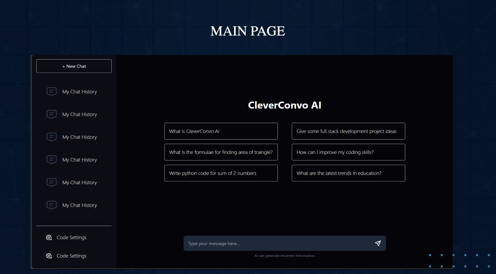

# CleverConvo AI - Advanced ChatGPT Clone


## 🚀 Features

### Core Functionality
- **Natural Language Processing** powered by OpenAI GPT-3.5/4 API
- **Real-time Streaming** of AI responses
- **Conversation History** with local storage
- **Code Syntax Highlighting** for technical responses
- **Markdown Support** for rich text formatting

### Enhanced UI/UX
- **Modern Dashboard** with sleek interface
- **Responsive Design** for all screen sizes
- **Dark/Light Mode** toggle
- **Animated Typing Indicators**
- **Customizable Themes**

### Advanced Features
- **Rate Limiting** to prevent API abuse
- **Prompt Templates** for common queries
- **Context-Aware Conversations**
- **Error Handling** with user-friendly messages
- **Performance Optimized** with React.memo

## 📸 Screenshots

### Welcome Page


### Chat Interface


## 🛠️ Tech Stack

| Component        | Technology           |
|------------------|----------------------|
| Frontend Framework | React 18            |
| Styling          | Tailwind CSS 3       |
| State Management | React Context API    |
| Build Tool       | Vite 4               |
| API Integration  | OpenAI Official API  |
| Deployment       | Vercel/Netlify       |

## 🚀 Quick Start

1. Clone the repository:
```bash
git clone https://github.com/yourusername/cleverconvo-ai.git
cd cleverconvo-ai
